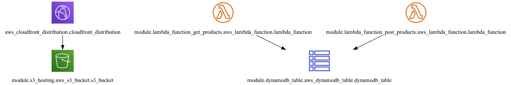

# Terraform AWS Serverless Project: S3 + CloudFront + Lambda + DynamoDB

Terraform project to provision static hosting on AWS S3 and deliver content securely via CloudFront CDN.

## 📌 Infrastructure Overview

This project provisions the following resources on AWS:

- **S3 Bucket**: static website hosting
- **CloudFront Distribution**: global CDN with HTTPS support
- **DynamoDB Table**: to store product data
- **Lambda Function**: `get_products`: read items from DynamoDB
- **Lambda Function**: `post_products`: write items into DynamoDB

### Architecture Diagram



## Project structure:

The project is under the src folder.

- **infra**: contains all Terraform files; run `terraform` commands from here
- **infra-modules**: reusable Terraform modules for resources
- **lambda-function-python**: Python source code for Lambda functions
- **lambda-function-python-zip**: folder used by Terraform to generate Lambda ZIPs
- **web-template**: static web templates to be uploaded to S3

## 🚀 Commands

Initialize, plan and apply:

```bash
terraform init
terraform plan -var-file='variables/dev.tfvars'
terraform apply -var-file='variables/dev.tfvars'
```

Destroy infrastructure:

```bash
terraform destroy -var-file='variables/dev.tfvars'
```

## Future Enhancements

Stay tuned! This project will be extended with new features and improvements, making it an even more complete serverless case study. 🚀

## License

This project is licensed under the **MIT License**. Use at your own risk. If something breaks, **it's your problem!** 😆

---

🚀 Happy Coding!
